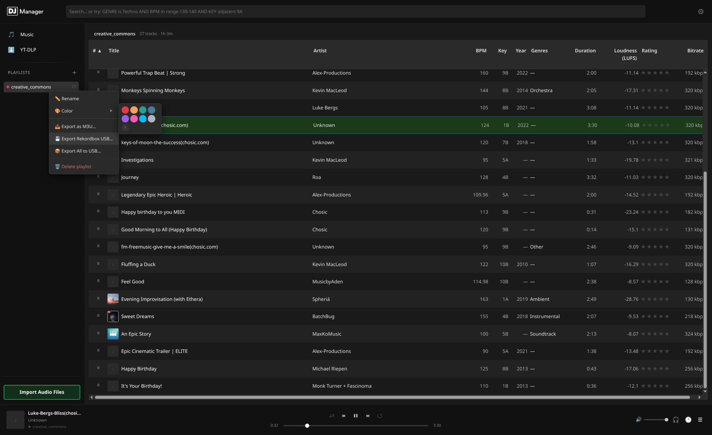

# DJ Manager

A DJ-focused music library manager built with Electron. Manage your tracks, analyze BPM and key, export to Pioneer CDJ USB drives, and download from streaming platforms — all in one offline-first desktop app.

[](https://github.com/Radexito/DjManager/actions/workflows/ci.yml)
[](LICENSE)
[](https://github.com/Radexito/DjManager/releases)
[](https://github.com/Radexito/DjManager/issues)
[](#download)



---

## Features

### 🎵 Music Library

- Import **MP3, FLAC, WAV, OGG, M4A, AAC, OPUS** with full metadata extraction
- SHA-1 deduplication — importing the same file twice is a no-op
- Virtualized infinite-scroll list (handles tens of thousands of tracks)
- Sort by any column: title, artist, album, BPM, key, loudness, duration, bitrate, year…
- Customizable column visibility and order, persisted between sessions
- Multi-select with **Ctrl+Click**, **Shift+Click range**, and **Ctrl+A**
- Inline track preview — click the play icon in any row to audition without leaving the library
- Per-track normalization status badge

### 🔍 Search & Filter

- Advanced field-qualified query syntax directly in the search bar:
  ```
  BPM >= 128 AND KEY:8A GENRE is Techno
  ARTIST:Burial YEAR > 2010
  BPM >= 120 AND KEY:12A
  ```
- Supports `AND`, `OR`, field names (`BPM`, `KEY`, `ARTIST`, `ALBUM`, `LABEL`, `GENRE`, `YEAR`, `BITRATE`), and comparison operators (`>=`, `<=`, `>`, `<`, `is`, `contains`)

### 📊 Auto-Analysis

- **BPM** detection via Mixxx analyzer (runs in background worker threads — import never blocks the UI)
- **Musical key** — raw notation + Camelot wheel (e.g. `8B`)
- **Loudness** — LUFS / ReplayGain
- **Intro / Outro** timestamps
- **Beatgrid** generation for CDJ export
- **Waveform** data (PWAV / PWV2 / PWV4 / PWV6) generated via FFmpeg
- Frequency band analysis (bass, mid, treble RMS) per slice

### 🎧 Audio Normalization

- Target loudness configurable in Settings (default **-9 LUFS**, range -60 to 0)
- Original file preserved — normalized copy stored separately, allowing export in either form
- Bulk normalize entire library or selected tracks
- Reset normalization per track or library-wide
- Auto-normalize on import (optional toggle in Settings)
- Player automatically prefers the normalized file when available

### 📝 Metadata & Auto-Tagging

- Edit title, artist, album, label, year, genres, comments — inline or in the details panel
- Bulk metadata editing across multiple selected tracks
- **Auto-tagger** searches MusicBrainz, Discogs, iTunes, and Deezer simultaneously
- Visual diff of current vs. suggested values — accept or reject per field
- Cover art picker with zoom/preview, sourced from MusicBrainz Cover Art Archive, iTunes, and Deezer
- BPM adjust shortcuts: ×2, ×0.5

### 📋 Playlists

- Create, rename, delete playlists (tracks remain in library)
- Add/remove tracks via context menu or drag-and-drop
- Drag-and-drop track reordering within a playlist
- Assign a colour to each playlist (8 presets)
- Import playlist from file — prompts which library playlist to add tracks to
- Export playlist as **M3U**

### 📁 File Explorer

Browse your filesystem directly inside DJ Manager — no need to import files to include them in analysis and USB export.

- **Native folder browser** — navigate your filesystem with a breadcrumb toolbar and back/forward navigation
- **Favourites sidebar** — right-click any folder to add it to a pinned favourites list; persisted between sessions
- **Quick-jump buttons** — home directory and native folder picker
- **🔗 Linked files** — link audio files or entire folders to the library without copying them; originals stay in place
  - Linked tracks shown with a 🔗 badge in the Music Library list
  - Artist / title extracted from ID3 tags with `"Artist - Title"` filename fallback
- **Link folder to library** — right-click a folder or use `+Library` toolbar button to link its audio files into:
  - All Music (no playlist)
  - A new named playlist
  - An existing playlist
  - Optional recursive scan (all subdirectories)
- **Recursive tree scan** (`🌲 Tree`) — scan a folder recursively and stream results in batches; cancel mid-scan
- **Live analysis** — `Analyze` button links + analyzes all audio files in the current folder; rows update in real-time as each track finishes analysis; button becomes `Cancel Analyzing…` and persists across navigation until all workers complete
- **Explicit confirm dialogs** for all mass operations (recursive scan, analyze, +Library) — describes the scope before running
- **Track details side panel** — click any row to open the same edit/metadata panel as the Music Library (non-breaking table layout)
- **🎛 Prepare Track (BeatGrid Editor)** — edit beatgrid directly from the explorer context menu
- **Status icons** — each row shows whether a file is linked (`🔗`), broken (`✗`), or untracked
- **Context menu per file**: play, link, link to playlist, open track details, prepare track, remap file, remove from library
- **Context menu per folder**: link folder, tree scan, add/remove favourite
- **🗑️ Remove file** — removes the file from the library **and deletes it from disk** (with confirmation dialog explaining the permanent deletion)

### ⬇️ Downloads (yt-dlp)

Paste any URL from **YouTube, SoundCloud, Bandcamp, Mixcloud, Vimeo, Twitch, Twitter/X, Instagram, Facebook, TikTok, Dailymotion, Deezer**, and 1000+ other yt-dlp-supported sites.

- Fetch playlist metadata before downloading — preview titles, durations, availability
- Deselect individual tracks from a playlist before starting the download
- Duplicate detection — URLs already in your library are highlighted
- Per-track and overall download progress in the sidebar
- Cancel in-progress downloads
- Browser cookie authentication (Chrome, Chromium, Brave, Firefox, LibreWolf, Edge) for sites requiring login
- Downloaded tracks import directly into the library and optionally into a playlist
- Channel name used as artist when video title contains no artist delimiter

### 🎵 TIDAL Download

Download from TIDAL via the [tidal-dl-ng](https://github.com/Radexito/tidal-dl-ng-For-DJ) integration.

- One-click login via device-link URL (opens in your browser)
- Paste any TIDAL track, album, or playlist URL to download at **HiRes Lossless** quality
- 3-step UI: login → paste URL → select tracks → download
- Duplicate detection — tracks already in your library are flagged before downloading
- Progress shown per track; imported directly into the library with full metadata

### 🎯 Cue Points & Auto-Cue

- **Cue Points Editor** — add, label, colour, and delete hot cues (A–H) and memory cues per track
- **CueGen Auto-Cue** — automatically generates hot cues A–H from the beatgrid (every N bars, configurable)
- Hot cues exported to Rekordbox USB with correct slot assignments, labels, and colours
- Cue marker overlay on the seekbar for visual reference during playback

### 🎮 Player

- Built-in player streaming from a local HTTP server (reliable Range request support for seeking)
- Keyboard shortcuts: **Space** (play/pause), media keys
- Seek bar, volume control, current time / duration
- Output device selection
- Queue management — queue stays in sync when tracks are added to the library or playlist during playback
- **Shuffle** and **Repeat** modes (none / all / one)
- 50-track play history ring buffer

### 💾 Rekordbox USB Export

Full **Pioneer CDJ / XDJ-compatible** export — plug the USB in and it just works.

- Exports the full library or individual playlists
- Writes **ANLZ0000.DAT / .EXT / .2EX** — waveform, beatgrid, intro/outro cue data
  - Hot cue slots **A–H** with correct Pioneer palette colour codes for CDJ hardware (PCPT) and Rekordbox PC (PCP2 extended colour wheel)
  - Memory cues, beatgrid (PQT2), high-res waveform (PWV5), colour waveform (PWV4), preview waveform (PWV3)
- Writes **export.pdb** — full DeviceSQL binary database (tracks, playlists, artwork, keys, ratings)
- Writes **MYSETTING.DAT / MYSETTING2.DAT / DEVSETTING.DAT** — hardware settings with correct CRC-16/XMODEM checksums
- USB filesystem validation (FAT32 / exFAT detection, format warnings)
- Export progress tracking

### ⚙️ Settings

| Section       | Options                                                                                   |
| ------------- | ----------------------------------------------------------------------------------------- |
| Library       | Custom library path, move library to new location                                         |
| Normalization | Target LUFS, auto-normalize on import, bulk normalize / reset                             |
| Downloads     | Browser cookie source, preferred audio format                                             |
| Dependencies  | View installed versions of ffmpeg / yt-dlp / analyzer, update individually or all at once |
| Advanced      | Clear library, reset all user data, view log files                                        |

---

## Download

Pre-built releases are available on the [GitHub Releases](https://github.com/Radexito/DjManager/releases) page.

| Platform | Format              |
| -------- | ------------------- |
| Linux    | AppImage (x64)      |
| macOS    | dmg (Apple Silicon) |
| Windows  | NSIS installer      |

On first launch, FFmpeg and the mixxx-analyzer binary are downloaded automatically.

---

## Development

```bash
# Install dependencies
npm install
cd renderer && npm install && cd ..

# Start dev server (Vite + Electron)
npm run dev

# Lint
npm run lint:all

# Format
npm run format

# Run tests
npm test                    # main process (Vitest)
cd renderer && npm test     # renderer (React Testing Library)

# Build distributable
npm run dist:linux          # or :mac / :win
```

> **Note:** Close the Electron app before running `npm test` — the pretest step rebuilds `better-sqlite3` for Node.js and will fail if Electron holds the binary open.

---

## Tech Stack


| Layer            | Technology                                        |
| ---------------- | ------------------------------------------------- |
| Shell            | **Electron** 40                                   |
| UI               | **React 19** + **Vite 8**                         |
| Database         | **better-sqlite3** (synchronous SQLite)           |
| Analysis         | **Mixxx analyzer** — BPM, key, loudness, beatgrid |
| Audio processing | **FFmpeg** — decode, waveform, format conversion  |
| Downloads        | **yt-dlp**                                        |
| Drag-and-drop    | **@dnd-kit**                                      |
| Virtual list     | **react-window**                                  |

---

## Acknowledgements

The Rekordbox USB export feature stands on the shoulders of a lot of excellent prior work in the Pioneer reverse engineering community.

- **[meiremans](https://github.com/meiremans)** — [beirbox-gui](https://github.com/meiremans/beirbox-gui) gave us our starting point for understanding the overall USB layout, ANLZ file sections, and DeviceSQL PDB structure.

- **[kimtore](https://github.com/kimtore)** — [rex](https://github.com/kimtore/rex), a Rekordbox USB exporter whose DeviceSQL PDB writing logic we studied closely and rewrote in JavaScript for DJ Manager.

- **[Deep-Symmetry](https://github.com/Deep-Symmetry)** — [crate-digger](https://github.com/Deep-Symmetry/crate-digger) and its Kaitai Struct definitions for `.DAT` / `.EXT` file parsing were invaluable for understanding the binary layout of ANLZ sections.

- **[jandk](https://github.com/jandk)** — for figuring out how Pioneer derives the USBANLZ folder path hash from the track's USB file path.

- **[bartvg](https://github.com/bartvg)** (Vettige Weust) — for patiently listening to way too much bacon. 🥓

---

## License

MIT © [Radexito](https://github.com/Radexito)
