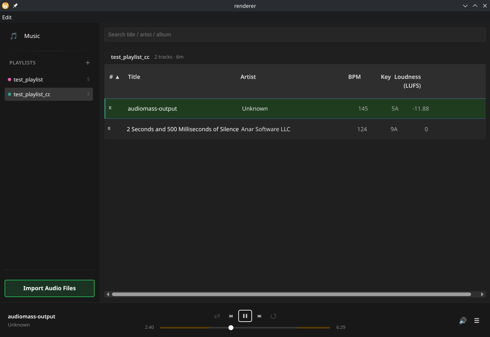

# DJ Manager

A **DJ-focused music library manager** built for real DJ workflows — not a consumer music player. Prioritises efficient library management, playlist curation, audio analysis, and fast navigation, while remaining fully offline.

**Stack:** Electron · React · SQLite · Python (`mixxx-analyzer`) · FFmpeg



---

## Installing

```bash
# Install FFmpeg (Linux)
chmod +x scripts/install-ffmpeg.sh
./scripts/install-ffmpeg.sh

# Install dependencies
npm install
cd renderer && npm install && cd ..

# Install Python analyser
pip install mixxx-analyzer

# Run
npm start
```

---

## Core Philosophy

* **One canonical storage pool** — files are imported once, referenced everywhere
* **Playlists as views, not copies** — tracks live in the library; playlists are ordered references
* **Metadata as a first-class citizen** — BPM, key, loudness, cue points drive every workflow
* **Built for DJs, not listeners** — every feature decision reflects real preparation and performance needs

---

## Progress

### ✅ Stage 1 — Foundation & Import Pipeline
> *Commits: `tech skeleton` → `feat: add SQLite database` → `feat: switch to persistent music library` → `feat: integrate react-window`*

- Electron + React + SQLite application skeleton
- SQLite database with WAL mode; schema migrations system
- Import audio files into a managed storage folder (`~/.config/dj_manager/audio/`)
- FFmpeg-based metadata extraction (duration, bitrate, format, sample rate, channels, codec)
- Virtualized track list with infinite scroll (`react-window`)
- Dark-themed UI with sortable columns

---

### ✅ Stage 2 — Audio Analysis
> *Commits: `3aed511` — Switch to mixxx-analyzer, add track context menu*

- Replaced custom analyser with [`mixxx-analyzer`](https://pypi.org/project/mixxx-analyzer/) Python package
- Per-track analysis: **BPM**, **musical key** (raw + Camelot notation), **loudness (LUFS)**, **replay gain**, **intro start**, **outro start**
- Analysis runs in the background; results written back to SQLite
- Track context menu: **Re-analyze**, **Remove**, *(Add to playlist — placeholder)*
- `bpm_override` column allows manual BPM correction (halve / double) without losing the original detected value; cleared automatically on re-analysis

---

### ✅ Stage 3 — Library Management & UI Polish
> *Commits: `feat: multi-select` → `fix+feat: resolve track loading bugs` → `chore: rename menu` → `fix: address PR review comments`*

- Multi-select tracks (click, Shift+click, Ctrl+click, Ctrl+A select-all)
- BPM double / halve submenu per track or selection
- Settings modal (music folder path, analysis preferences)
- Refactored into `Sidebar` + `MusicLibrary` components
- Auto-refresh library on import completion
- Dropped unused columns (status, gain); surfaced `replay_gain` in track table
- Full-text search and numeric sort on all columns

---

### ✅ Stage 4 — Playlists
> *Commits: `feat: implement full playlist feature` (PR #6)*

- Create, rename, delete, and colour-code playlists from the sidebar
- Add tracks to playlists via right-click context menu (multi-select supported)
- Remove tracks from a playlist
- Drag-and-drop reorder within a playlist (`@dnd-kit`)
- **Save Order** button to persist manual ordering to the database
- Sort by any column (BPM, title, …) within a playlist; sorting auto-resets to position order on DnD
- BPM sort respects `bpm_override`
- Playlist track count and total duration shown in header

---

### ✅ Stage 5 — Audio Player
> *Commits: `5a935a3` + `109550b` on `player` branch*

- **Player bar** (Spotify / Tidal style) pinned to the bottom of the window
  - Left: album art placeholder, track title, artist
  - Centre: Shuffle · Previous · Play/Pause · Next · Repeat, with seekbar below
  - Right: audio output device picker, "go to playlist" hamburger button
- Playback via a custom `media://` Electron protocol with **Range / 206 partial-content** support — enables true seeking on large files
- Path encoding for files with spaces or Unicode characters
- Rapid track switching is safe: `audio.pause()` before src swap + per-generation counter to drop stale `AbortError` rejections; `?t=gen` cache-bust prevents Chromium pipeline errors when revisiting a file
- **Seekbar intro/outro zones** — amber gradient regions derived from `intro_secs` / `outro_secs` stored by the analyser
- **Hardware media key support** via `navigator.mediaSession` (play/pause/next/prev/seek)
- **Spacebar** toggles play/pause unless focus is in a text field
- Double-click any track in library or playlist to play
- Playing-track highlight is view-scoped: green row shows only in the view (library vs playlist) that triggered playback; preserved through next/prev/ended navigation
- Audio output device selection via `setSinkId`

---

## Planned

### Stage 6 — Advanced Search & Smart Playlists
- Query builder UI (text + numeric filters, Boolean logic)
- Key compatibility rules (Camelot wheel)
- Saved searches / smart playlists that auto-update
- Track context menu: **Find similar** (by BPM range, key compatibility, genre)
- **"Play unheard"** mode — continuous playback of tracks never played, for library discovery

### Stage 7 — Player & Library Enhancements
- **"Playing from: \<playlist name\>"** label in the player bar
- **Volume control** on the speaker icon in the player bar
- **Playback history** — recall what was playing N tracks ago (ring buffer of recent plays)
- **Track thumbnails** (waveform preview or album art)
- **User ratings** (star rating per track)
- **User tagging** — freeform tags per track for custom organisation
- **ID3 tag read/write** — full read of embedded tags on import; write-back of analysed metadata (BPM, key, replay gain) to ID3v2/Vorbis/MP4 tags
- **Loudness equalisation** across playlists — auto-adjust gain so every track plays at a consistent LUFS target

### Stage 8 — Playlist Export & DJ Software Interop
- **M3U / M3U8 export** for universal player compatibility
- **Rekordbox XML export** — playlists, cue points, hot cues, memory cues, beatgrid, colour tags; compatible with Pioneer CDJ / XDJ
- **Serato export** — write Serato ID3 frames (`GEOB` tags) so cues and loops appear in Serato DJ
- **Traktor NML export** — generate Traktor collection XML with cue points and playlist structure
- **Hot cues, memory cues, loop markers** stored in DB and round-tripped to/from all three formats

### Stage 9 — Downloads & Ingestion
- **yt-dlp integration** — download audio from YouTube/SoundCloud/etc. directly into the library
- Incoming folder watcher with automatic analysis and review queue before final import
- Source tracking (URL, platform, original quality)

### Stage 10 — Distribution & CI/CD
- **GitHub Actions workflow** to build and package for Windows, Linux (AppImage/deb), and macOS
- Signed releases served via GitHub Releases on every version tag
- Auto-update mechanism inside the app

### Stage 11 — Radio & Discovery Mode
- Continuous playback driven by rules (genre, BPM range, energy flow)
- Avoid recently played tracks; maintain harmonic flow
- Rate tracks and add to playlists during playback

### Stage 12 — AI-Assisted Discovery
- Similarity search (BPM proximity, key compatibility, genre overlap)
- Auto set-building suggestions
- Warm-up vs peak-time classification

---

## Architecture

| Layer | Technology |
|---|---|
| Desktop shell | Electron |
| UI | React + Vite |
| Database | SQLite (better-sqlite3, WAL mode) |
| Audio decode / metadata | FFmpeg |
| Audio analysis | `mixxx-analyzer` (Python) |
| Drag and drop | `@dnd-kit` |
| Virtualised lists | `react-window` |
| Playback | HTML5 Audio + custom `media://` protocol |

### File Storage
All imported audio is stored once at `~/.config/dj_manager/audio/<xx>/<hash>.<ext>` (two-char hash prefix for filesystem performance). Playlists reference tracks by ID; no files are duplicated.

### Database Schema (key tables)
- `tracks` — file path, metadata, analysis results (`bpm`, `bpm_override`, `key_camelot`, `loudness`, `replay_gain`, `intro_secs`, `outro_secs`, …)
- `playlists` — id, name, color
- `playlist_tracks` — playlist_id, track_id, position
